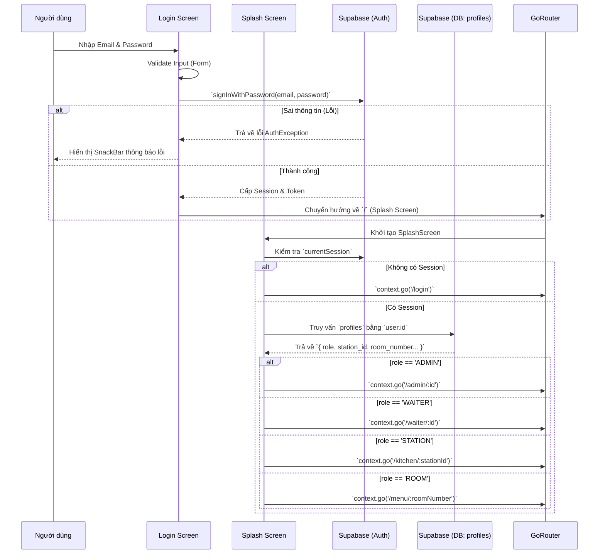

# Luồng Xử Lý Chức Năng Đăng Nhập (Login Flow) - DineTap

Tài liệu này mô tả chi tiết quy trình xác thực và phân quyền người dùng (Role-Based Access Control - RBAC) trong dự án **DineTap (Inroom Dining)**, sử dụng Flutter và Supabase.

---

## 1. Sơ đồ Luồng (Flowchart)

---

## 2. Các Bước Xử Lý Chi Tiết

### Bước 1: Giao diện Đăng nhập (`login_screen.dart`)
- Người dùng nhập Email và Mật khẩu.
- Khi nhấn nút **SIGN IN** (hoặc nhấn phím Enter), hàm `_signIn()` được gọi.
- **Xử lý:** 
  - Đặt trạng thái `_isLoading = true` để vô hiệu hóa nút bấm và hiển thị vòng xoay loading.
  - Gửi yêu cầu xác thực đến **Supabase Auth** thông qua hàm `supabase.auth.signInWithPassword()`.
  - Nếu gặp lỗi (sai mật khẩu, email không tồn tại), bắt exception (`AuthException`) và hiển thị `SnackBar` thông báo lỗi.
  - Nếu thành công, sử dụng `context.go('/')` để đẩy về màn hình chờ (Splash Screen).

### Bước 2: State Management (`auth_provider.dart`)
Ngay khi có sự kiện đăng nhập thành công:
- **`sessionStreamProvider`**: Lắng nghe sự kiện `onAuthStateChange` từ Supabase. Trạng thái toàn cục cập nhật sang "Signed In".
- **`userProfileProvider`**: Tự động kích hoạt, truy vấn lấy dữ liệu từ bảng `profiles` để cache dữ liệu hồ sơ (Profile) ở phạm vi toàn cục (Global State) nhằm sử dụng cho các chức năng check quyền lợi về sau trong App.

### Bước 3: Phân luồng dữ liệu (Routing/Role Checking) tại `splash_screen.dart`
Màn hình Splash đóng vai trò như một **Middleware** điều hướng.
- Tại hàm `initState()`, gọi `_checkAuthState()`.
- Lấy thông tin `session` hiện tại. Nếu `session == null`, đẩy người dùng ngược lại trang `/login`.
- Nếu có session, ứng dụng thực hiện truy vấn tới bảng `profiles` trong cơ sở dữ liệu Supabase bằng `session.user.id`.
- Tùy thuộc vào giá trị cột `role`, `GoRouter` sẽ đẩy người dùng tới Dashboard tương ứng:
  - **`ADMIN`**: Chuyển đến `/admin/:id` (Giao diện Quản trị viên).
  - **`WAITER`**: Chuyển đến `/waiter/:id` (Giao diện Nhân viên phục vụ).
  - **`STATION`**: Chuyển đến `/kitchen/:stationId` (Giao diện Nhà bếp, trích xuất thêm `station_id` để biết bếp phụ trách khu vực nào).
  - **`ROOM`**: Chuyển đến `/menu/:roomNumber` (Giao diện Khách hàng gọi món, trích xuất thêm `room_number` để gán cho đơn hàng).

### Bước 4: Xử lý ngoại lệ tại Splash
- Nếu vì lý do nào đó (mất mạng, người dùng bị xóa khỏi bảng `profiles` dù vẫn còn token auth), tiến trình lấy profile thất bại.
- Ứng dụng sẽ bắt exception, gọi `supabase.auth.signOut()` để xóa token rác và lập tức đẩy về `/login` để tránh việc người dùng bị kẹt lại ở màn hình Loading (Splash Screen).

---
*Tài liệu được sinh tự động bởi hệ thống AI hỗ trợ phát triển DineTap.*
